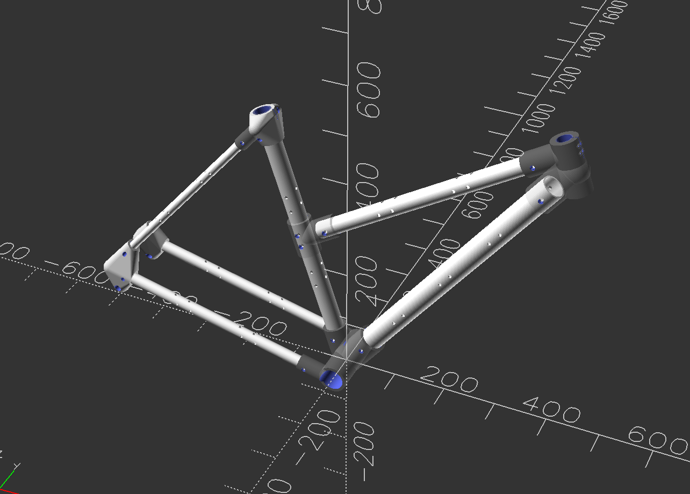

# Parametric Bicycle

Check out the Makefile. You'll need a newer version of OpenSCAD, and if you render in the app you should enable the Manifold backend if possible for massive performance gains.
